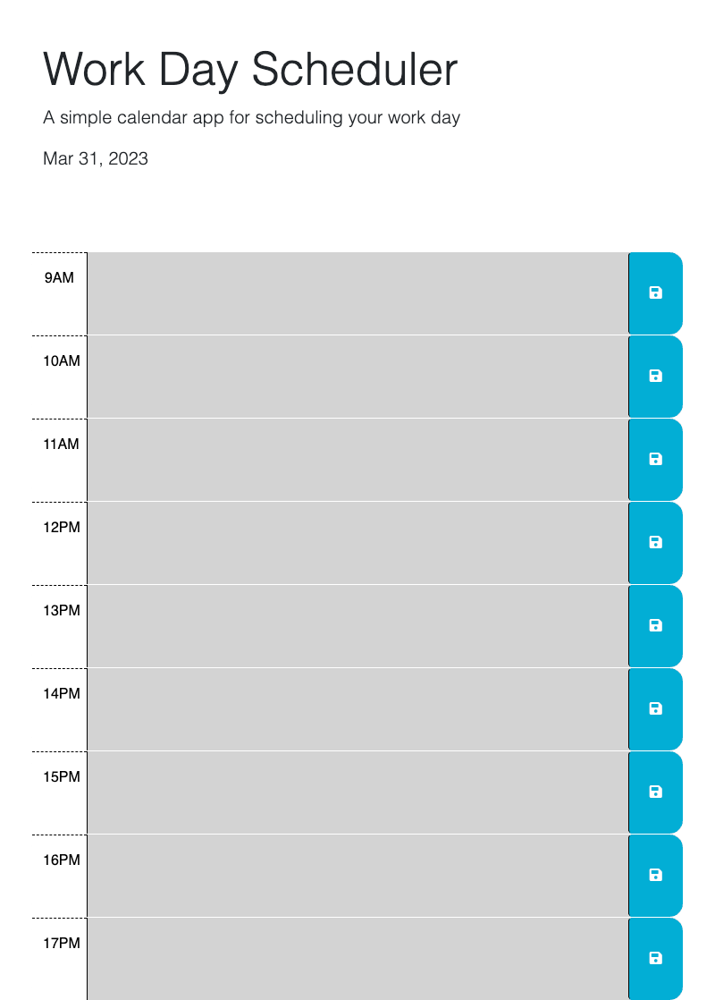

# Work-Day-Scheduler

## Desricption

The following is a Work Day Scheduler. When opening the planner the current day is displayed at the top of the calendar. There are time-blocks for each hour of the working day where you can enter events and or reminders. Click the corresponding time-block save button and Events/reminders are saved to local storage. After page is refreshed the saved events persist. 

## Author 

Keegan Omel

## Contributors

Austin Grech,

Bruno Rosarini

## Live Link

https://keegan-omel.github.io/Work-Day-Scheduler/

## GitHub Link

https://github.com/Keegan-Omel/Work-Day-Scheduler

